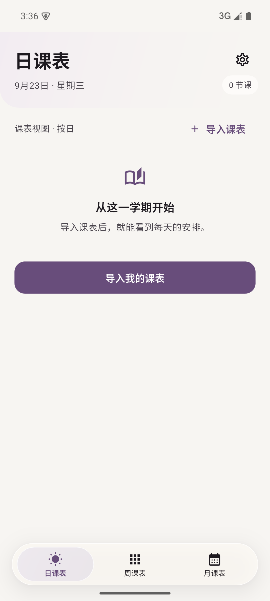
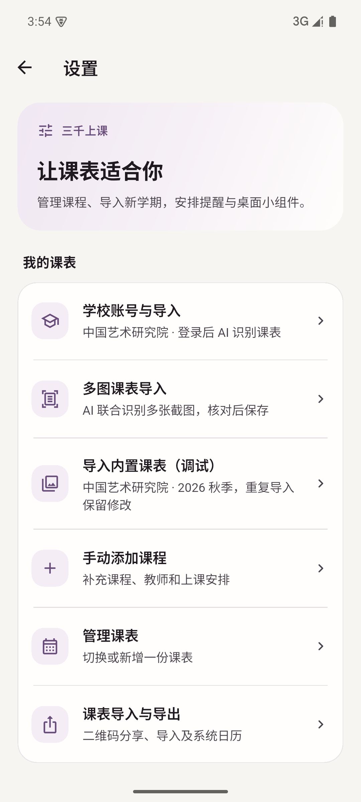

  
  <h1>三千上课</h1>
  
把课程安排好，每天上课一眼看清。

三千上课是一款面向学生的个人课表 App。导入或录入课程后，可以按日、周、月查看安排，并用提醒和桌面小组件减少忘课、找教室的麻烦。

## 看看界面

<table>
  <tr>
    <td align="center"> 日课表：快速查看当天安排</td>
    <td align="center"> 设置：导入、提醒、小组件与外观</td>
  </tr>
</table>

## 可以做什么

- **导入课程**：从支持的学校教务系统或课表图片导入；识别结果可核对后保存，也可以手动添加和修改。
- **查看安排**：在日、周、月视图中查看课程时间、地点和教师。
- **及时提醒**：设置上课提醒，添加桌面小组件，或将课程导出到系统日历。
- **管理与分享**：管理多份课表，通过二维码导入或分享。
- **离线查看**：已保存的课表数据保存在本机，可离线查看。

适合想更方便地整理课程、查看每天安排的高校学生，以及其他需要管理个人课程表的人。

## 平台

Android · iOS
